# Juego Chilote (nombre provisorio)

**Un metroidvania oscuro inspirado en los mitos y leyendas de Chiloé.**

Eres el fiscal de la capilla de Quicaví. Una noche de niebla despiertas junto a la
iglesia y algo anda mal en la isla: el Trauco ronda el bosque, el Chonchón canta
"tue tue" sobre los acantilados y desde la Cueva de Quicaví, donde se reúnen los
brujos de la Recta Provincia, sube algo que no debería existir. Con tu cruz de
madera y lo que les quites a las criaturas del mito, tienes que bajar hasta el
fondo de la cueva y enfrentar al Invunche.

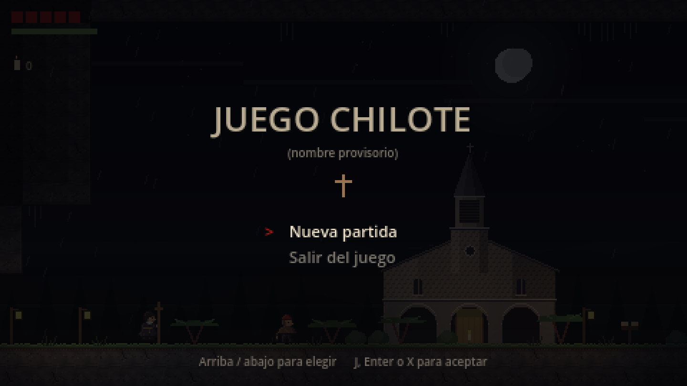

## Descargar

**[⬇ Descargar la última versión](../../releases/latest)** (Windows, un .zip de unos 40 MB)

1. Descarga el `.zip` de la versión que quieras (abajo, en "Versiones", están todas).
2. Descomprímelo y abre `JuegoChilote.exe`. No necesita instalación.
3. Si Windows muestra "Windows protegió su PC", haz clic en **Más información** y
   después en **Ejecutar de todas formas**. Aparece porque el juego no está firmado
   (es un proyecto personal), no porque tenga algo malo.

Se juega con teclado o con control de Xbox.

## De qué se trata

- **Mitos de Chiloé.** Cada criatura viene de una leyenda: el Trauco con su hacha
  de piedra, el Chonchón (la cabeza voladora de un brujo), el Basilisco, el
  Camahueto (el torito de un solo cuerno), el Caleuche y, al fondo, el Invunche,
  el guardián deforme de la cueva.
- **Combate a lo Dark Souls, en 2D.** Cada enemigo avisa antes de atacar; atacar y
  esquivar gastan energía, y para curarte tienes pocas infusiones de natre
  ("más malo que el natre") que se rellenan al descansar en una capilla.
- **Un mapa conectado.** 22 salas en cuatro sectores: la caleta y la iglesia, el
  bosque del Trauco, los acantilados del Caleuche y la Cueva de Quicaví. Con el
  Cuerno del Camahueto rompes muros, con la Pluma del Chonchón planeas y con el
  Farol del Caleuche ves lo que la niebla esconde.
- **Capillas chilotas** donde descansar, guardar y ofrendar la cera de vela que
  sueltan las criaturas para hacerte más fuerte.
- **Música de la isla**, hecha con acordeón, guitarra, rabel, bombo legüero y el
  armonio de la capilla, llevados a lo oscuro.

## Capturas

| | |
| --- | --- |
| 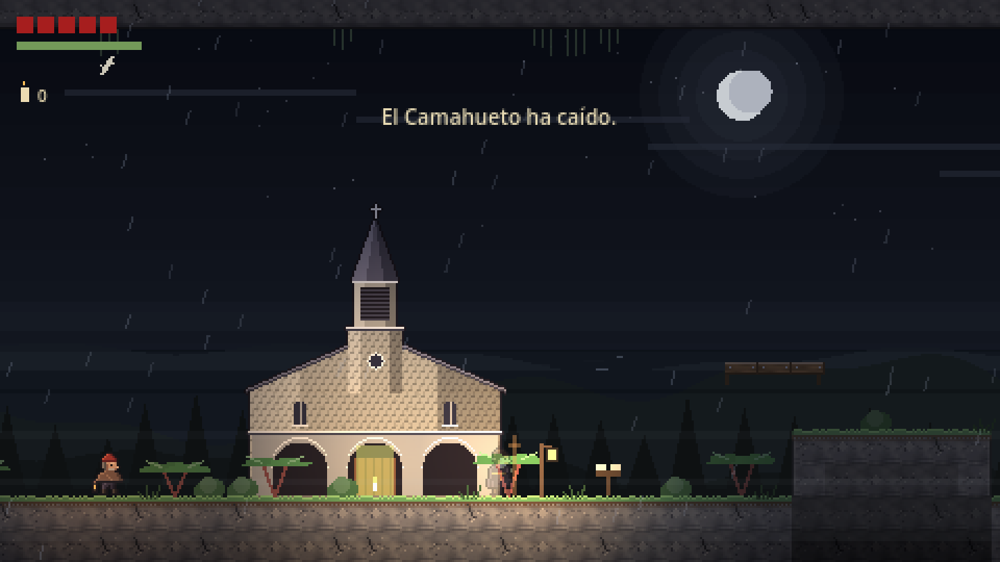 La iglesia de San Pedro de Quicaví, donde empieza todo. | 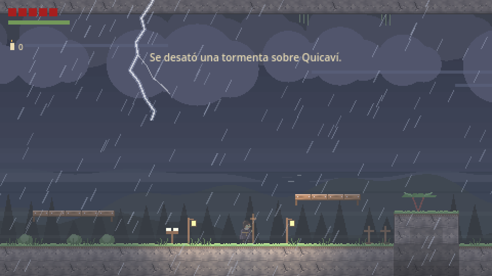 La tormenta sobre Quicaví. |
| 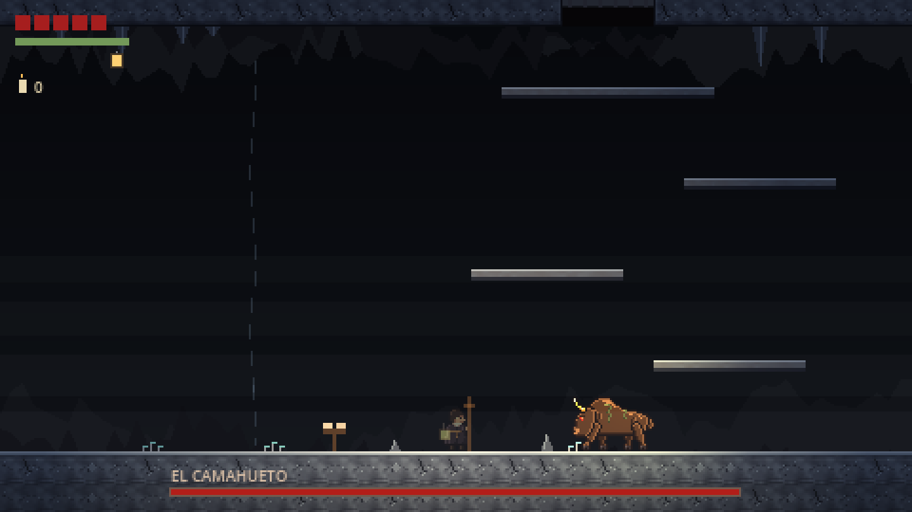 El Camahueto, que guarda su cuerno. | 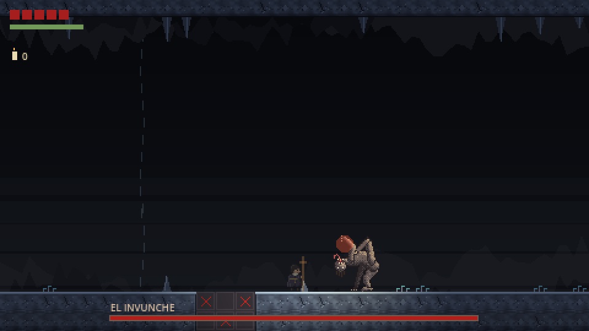 El Invunche, al fondo de la cueva. |
| 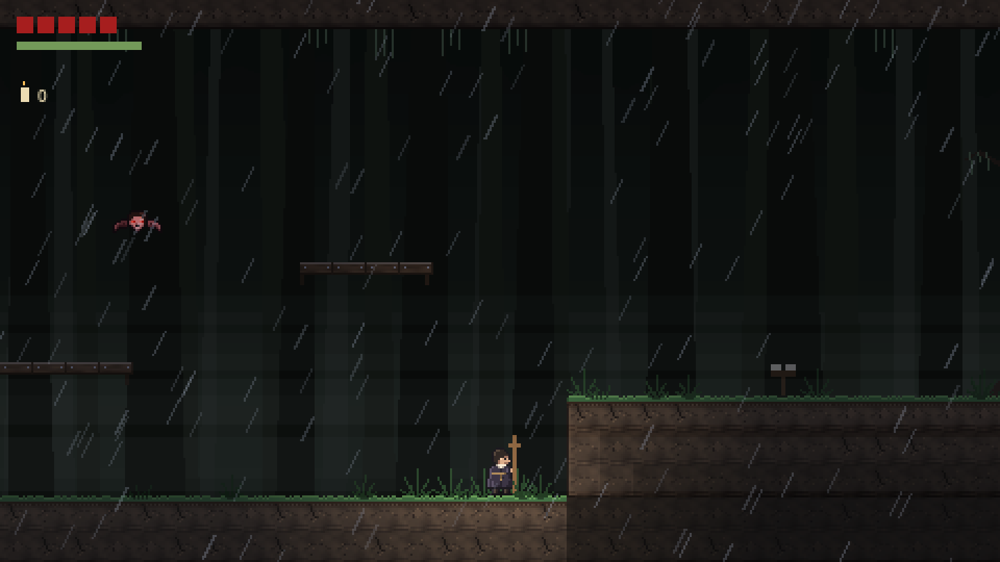 El bosque del Trauco. | 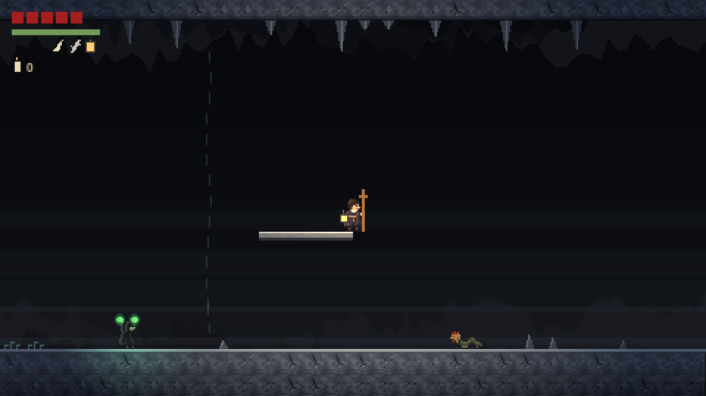 La cueva, con el Farol del Caleuche. |
| 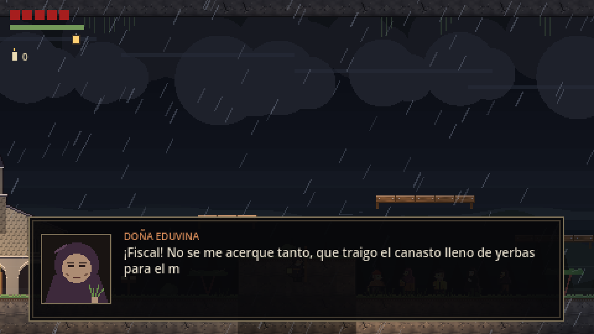 Doña Eduvina, la meica, te da el natre. | 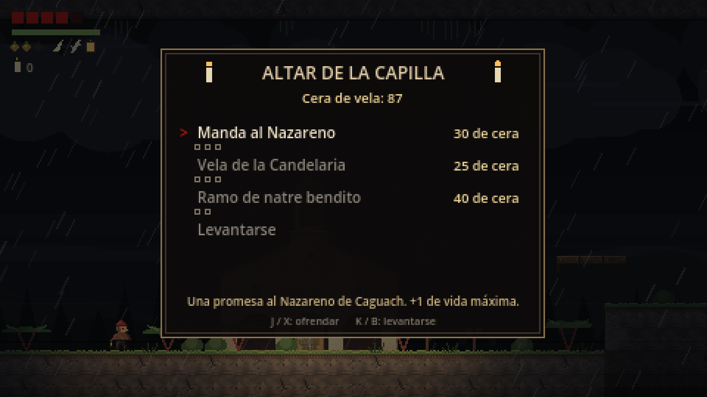 El altar de la capilla: ofrendas de cera. |
| 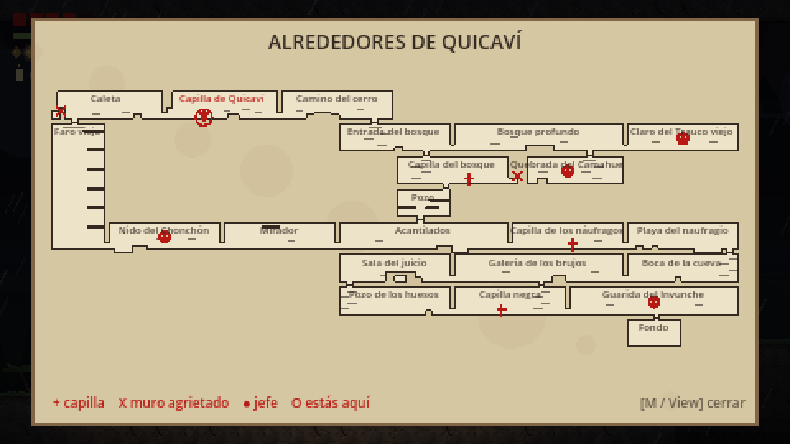 El mapa completo, sin minimapa. | 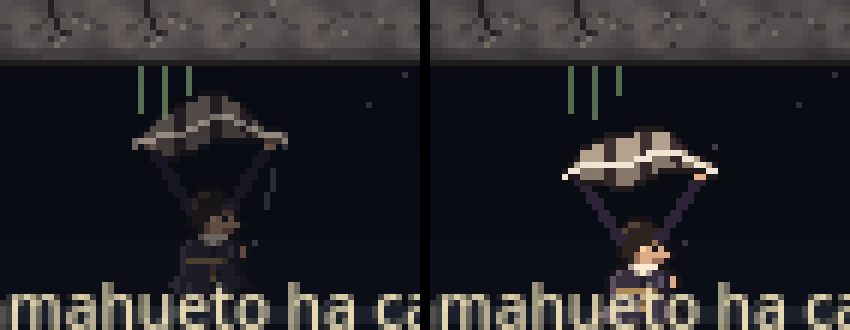 Planeando con la Pluma del Chonchón. |

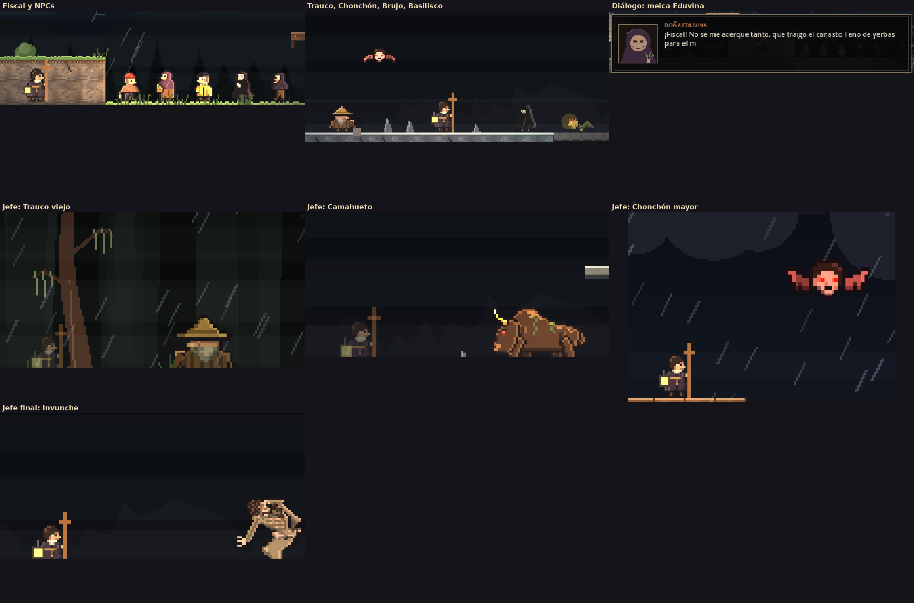

## Controles

| Acción | Teclado | Control Xbox |
| --- | --- | --- |
| Moverse | A / D o flechas | Palanca izquierda o cruceta |
| Saltar (mantén para saltar más alto) | Espacio | A |
| Atacar con la cruz (cadena de 3 golpes) | J | X |
| Esquivar rodando | K o Shift | B |
| Tomar una infusión de natre | L | Y |
| Embestida con el Cuerno del Camahueto | U | RB |
| Planear con la Pluma del Chonchón (en el aire) | mantener Espacio | mantener A |
| Descansar en la capilla / leer / hablar | W o flecha arriba | Cruceta arriba |
| Mapa | M o Tab | View |
| Pausa | Esc o P | Menu (Start) |

## Versiones

Todas las versiones quedan guardadas para descargar en
**[Releases](../../releases)**, cada una con su lista de cambios.

| Versión | Qué trae |
| --- | --- |
| [v0.7](../../releases/tag/v0.7) | La pluma ondea al planear, los jefes sueltan su premio, más sonido en la carga del Camahueto. |
| [v0.6](../../releases/tag/v0.6) | La pelea con el Camahueto, tormenta en todo el exterior, música del bosque. |
| [v0.5](../../releases/tag/v0.5) | Tormenta tras el faro, infusiones de natre, la iglesia de Quicaví, canción del Invunche. |
| [v0.4](../../releases/tag/v0.4) | Cera de vela y altar, ataques nuevos, volumen, sprites en pixel art. |
| [v0.3](../../releases/tag/v0.3) | Cadena de tres golpes, música, guardado en capillas, personas con quienes hablar. |
| [v0.2](../../releases/tag/v0.2) | El mapa completo: 22 salas, tres habilidades y tres jefes. |
| [v0.1](../../releases/tag/v0.1) | Las primeras salas, el combate y el Cuerno del Camahueto. |

